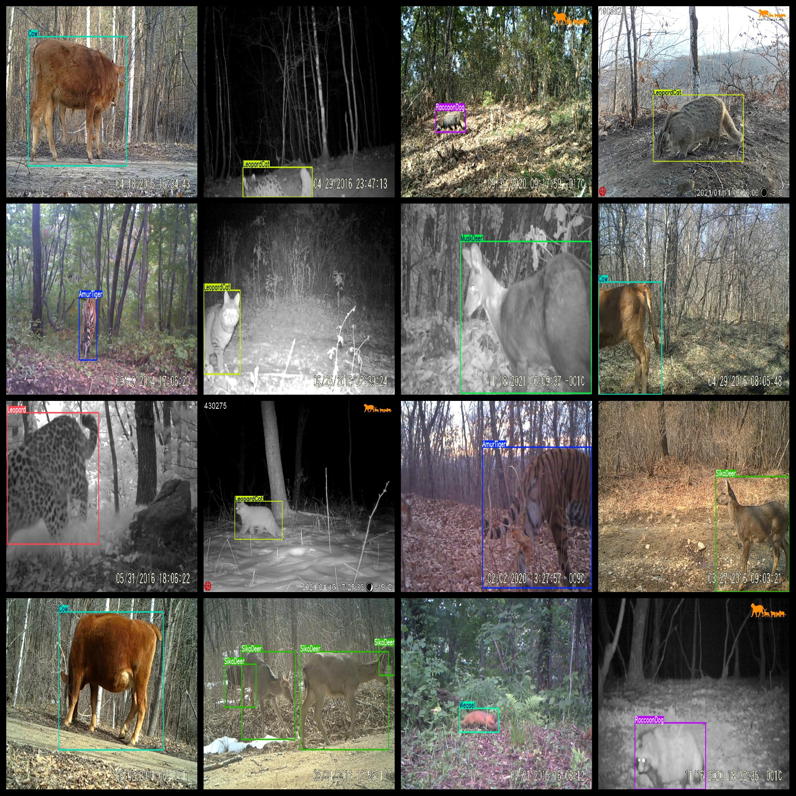
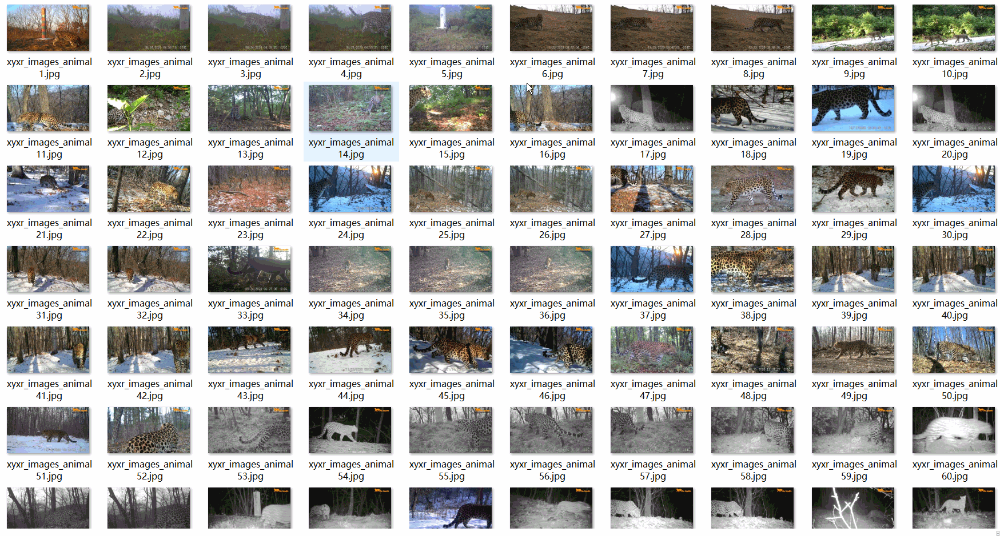
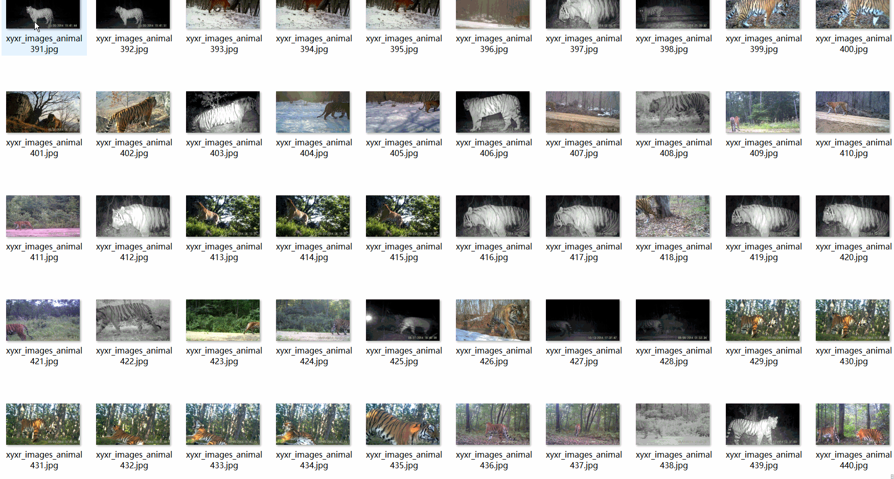

# 17 typesWild Animal Dataset 9808 imagesVOC+YOLO format

The 17 species of wildlife dataset consists of 9808 VOC + YOLO format images.

Dataset format: Pascal VOC format + YOLO format (the txt file does not contain the split path, it only contains jpg images and corresponding VOC format xml files and yolo format txt files)

Number of images (number of jpg files): 9808

Number of xml files: 9808

Number of txt files: 9808

Number of categories: 17

The Github repository is: datasets_sl

["Badger", "AmurTiger", "BlackBear", "Cow", "Dog", "Hare", "Leopard", "LeopardCat", "MuskDeer", "RaccoonDog", "RedFox", "RoeDeer", "Sable", "SikaDeer", "Weasel", "WildBoar", "Y-T-Marten"]

Northeast Tiger, Badger, Black Bear, Deer, Dog, Rabbit, Leopard, Weasel, Musk Deer, Hog, Fox, Ptarmigan, Deer Pangolin, Musk Deer, Red Fox, Moose, Weasel Badger

Number of boxes labeled in each category:

The number of boxes in AmurTiger is 526.

Badger frame count = 534

BlackBear frame count = 568

Cow frame count = 595

Dog frame count = 560

Hare Frame Number = 482

Leopard box count = 571

The number of LeopardCats is 783.

MuskDeer frame count = 463

The number of raccoons in the box is 611.

RedFox Frame Count = 705

【】『』「」【881】

Sable Frames = 240

SikaDeer Frames = 970

Weasel Frame Count = 492

WildBoar Frames = 889

Y-T-Marten frame count = 429

Total frame count: 10299

Number of images per category:

AmurTiger has 524 pictures.

Badger owns 508 pictures.

BlackBear holds a picture count = 548

Cow occupies a picture = 512

Dog has 541 pictures.

Hare occupies 482 pictures.

Leopard has 566 pictures.

LeopardCat has 782 images.

MuskDeer occupies a picture count of 461.

RaccoonDog has 569 pictures

RedFox owns 699 images.

RoeDeer occupies = 843

Sable owns 229 images.

SikaDeer owns 828 images.

Weasel owns 482 images.

WildBoar has 844 images.

Y-T-Marten owns a picture count = 390

Image resolution: 1280x720

Use the labeling tool: labelImg

Dataset Augmentation: Yes

Rules for annotation: Draw a rectangle around the category.

Important note: The dataset does not have been divided into training, validation, and testing sets.

Special Disclaimer: This dataset does not guarantee the accuracy of the trained models or weight files.

Annotation and image details are as follows:

## Images

---

Here is a pay link on Stripe (https://buy.stripe.com/3cs8yP7sY87d0vu9AB). Please contact me lonlonago@foxmail.com after funding $89, and I will send you a complete data files, thank you!

